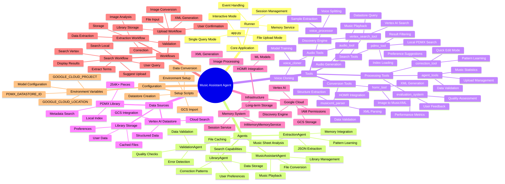

# Music Assistant Agent - Project Mindmap



## Text-Based Mindmap Structure

```
Music Assistant Agent
│
├── Core Application (app.py)
│   ├── Interactive Mode
│   │   ├── User Input Loop
│   │   ├── File Upload Handling
│   │   └── Response Streaming
│   ├── Single Query Mode
│   └── File Processing Mode
│
├── Agents
│   ├── MusicAssistantAgent
│   │   ├── Search Functions
│   │   │   ├── search_vertex_pdmx()
│   │   │   └── search_pdmx()
│   │   ├── Conversion Functions
│   │   │   └── convert_image_to_musicxml()
│   │   ├── Playback Functions
│   │   │   └── play_music()
│   │   └── Library Functions
│   │       └── add_to_library_tool()
│   │
│   ├── ExtractionAgent
│   │   ├── Image Analysis
│   │   ├── JSON Extraction
│   │   ├── Memory Integration
│   │   └── Pattern Learning
│   │
│   ├── LibraryAgent
│   │   ├── File Management
│   │   ├── User Preferences
│   │   ├── Caching System
│   │   └── Correction Tracking
│   │
│   └── ValidationAgent
│       ├── Data Validation
│       └── Quality Checks
│
├── Tools
│   ├── Search Tools
│   │   ├── vertex_search_tool.py
│   │   │   ├── VertexSearchTool class
│   │   │   ├── Discovery Engine Client
│   │   │   └── search_vertex_pdmx()
│   │   │
│   │   └── pdmx_tool.py
│   │       ├── Local Index Loading
│   │       └── search_pdmx()
│   │
│   ├── Conversion Tools
│   │   ├── homr_tool.py
│   │   │   └── HOMR Integration
│   │   │
│   │   └── musicxml_parser.py
│   │       └── XML Parsing
│   │
│   ├── Processing Tools
│   │   ├── agent_tools.py
│   │   ├── correction_tool.py
│   │   └── evaluation_system.py
│   │
│   └── Audio Tools
│       ├── audio_tool.py
│       ├── voice_processor.py
│       └── voice_cloner.py
│
├── Data Sources
│   ├── PDMX Library
│   │   ├── Local Index (254K+ pieces)
│   │   └── Metadata Search
│   │
│   ├── Vertex AI Datastore
│   │   ├── Cloud Search
│   │   ├── GCS Integration
│   │   └── Structured Data
│   │
│   └── Library Storage
│       ├── Cached Files
│       └── User Preferences
│
├── Infrastructure
│   ├── Google Cloud
│   │   ├── Vertex AI
│   │   ├── Discovery Engine
│   │   ├── GCS Storage
│   │   └── IAM Permissions
│   │
│   ├── HOMR Integration
│   │   ├── Image Processing
│   │   ├── ML Models
│   │   └── XML Generation
│   │
│   └── Memory System
│       ├── InMemoryMemoryService
│       ├── Session Service
│       └── Long-term Storage
│
└── Workflows
    ├── Search Workflow
    │   ├── User Query → Extract Terms
    │   ├── Search Vertex AI
    │   ├── Search Local PDMX
    │   ├── Display Results
    │   └── Suggest Upload (if no results)
    │
    ├── Upload Workflow
    │   ├── File Input
    │   ├── Image Conversion (HOMR)
    │   ├── XML Generation
    │   ├── Library Storage
    │   └── User Confirmation
    │
    └── Extraction Workflow
        ├── Image Analysis
        ├── Data Extraction
        ├── Validation
        ├── Correction
        └── Storage
```

## Key Components

### 1. **Core Application (app.py)**
- Entry point for the application
- Handles user interactions
- Manages sessions and memory
- Coordinates agent execution

### 2. **Agents**
- **MusicAssistantAgent**: Main agent for user interactions
- **ExtractionAgent**: Specialized for music sheet analysis
- **LibraryAgent**: Manages music library and user preferences
- **ValidationAgent**: Validates extracted data quality

### 3. **Tools**
- **Search Tools**: Query PDMX library and Vertex AI
- **Conversion Tools**: Convert images to MusicXML
- **Processing Tools**: Data validation and correction
- **Audio Tools**: Playback and voice processing

### 4. **Data Sources**
- **PDMX Library**: Local index with 254K+ music pieces
- **Vertex AI Datastore**: Cloud-based searchable database
- **Library Storage**: User's personal music collection

### 5. **Infrastructure**
- **Google Cloud**: Vertex AI, Discovery Engine, GCS
- **HOMR**: Handwritten Optical Music Recognition
- **Memory System**: Session and long-term memory management

## Data Flow

```
User Input
    ↓
MusicAssistantAgent
    ↓
    ├─→ Search Request → [Vertex Search + Local PDMX] → Results
    │
    └─→ Upload Request → [HOMR Conversion] → MusicXML → Library
```

## Integration Points

1. **Google ADK**: Agent Development Kit for building agents
2. **Discovery Engine**: Vertex AI Search for cloud-based search
3. **HOMR**: External tool for image-to-MusicXML conversion
4. **Memory Service**: Stores user preferences and patterns
5. **Session Service**: Manages conversation context

